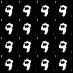
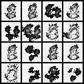

# GAN_MNIST_PYTORCH

### Command to execute the program: 
#### Convolutional GAN
python main.py -c 
#### Linear GAN 
python main.py -l

## Pytorch Implementation of GAN 

#### Loss of the discriminator on 50 epochs (on Test Dataset)

#### Loss of the generator on 50 epochs (on Test Dataset)

#### 50 Iterations

#### Mode Collapse, the model fails to generate various images
 
 
#### Pockemon Generation ? 

 
 Display on tensorboard__   
+ you can check the results on tensorboard.

  ~~~
  $ tensorboard --logdir repo/tensorboard --port 8888
  $ <host_ip>:8888 at your browser.
  ~~~
  
 GPU is preferred
